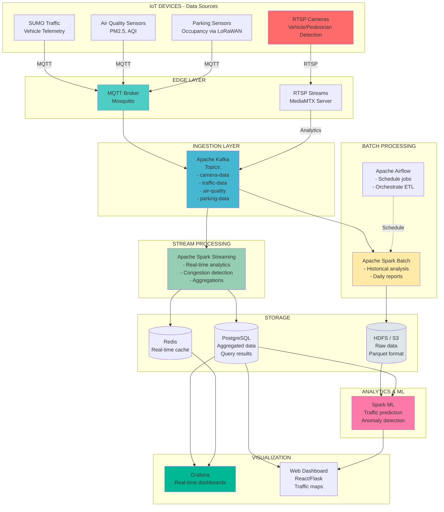
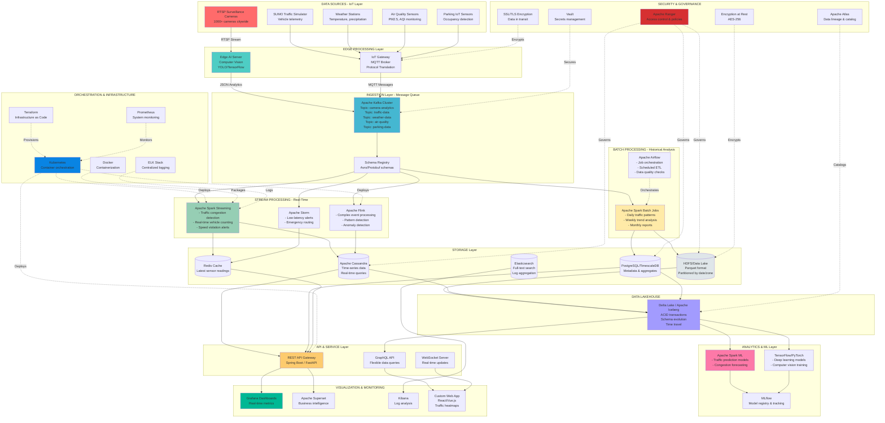

# smart-city-data-pipeline

## simple-graphe-arch

```mermaid
graph TB
    subgraph "IoT DEVICES - Data Sources"
        A1[RTSP Cameras<br/>Vehicle/Pedestrian Detection]
        A2[SUMO Traffic<br/>Vehicle Telemetry]
        A3[Air Quality Sensors<br/>PM2.5, AQI]
        A4[Parking Sensors<br/>Occupancy via LoRaWAN]
    end

    subgraph "EDGE LAYER"
        B1[MQTT Broker<br/>Mosquitto]
        B2[RTSP Streams<br/>MediaMTX Server]
    end

    subgraph "INGESTION LAYER"
        C1[Apache Kafka<br/>Topics:<br/>- camera-data<br/>- traffic-data<br/>- air-quality<br/>- parking-data]
    end

    subgraph "STREAM PROCESSING"
        D1[Apache Spark Streaming<br/>- Real-time analytics<br/>- Congestion detection<br/>- Aggregations]
    end

    subgraph "BATCH PROCESSING"
        E1[Apache Spark Batch<br/>- Historical analysis<br/>- Daily reports]
        E2[Apache Airflow<br/>- Schedule jobs<br/>- Orchestrate ETL]
    end

    subgraph "STORAGE"
        F1[(HDFS / S3<br/>Raw data<br/>Parquet format)]
        F2[(PostgreSQL<br/>Aggregated data<br/>Query results)]
        F3[(Redis<br/>Real-time cache)]
    end

    subgraph "ANALYTICS & ML"
        H1[Spark ML<br/>Traffic prediction<br/>Anomaly detection]
    end

    subgraph "VISUALIZATION"
        J1[Grafana<br/>Real-time dashboards]
        J2[Web Dashboard<br/>React/Flask<br/>Traffic maps]
    end

    %% Data Flow
    A1 -->|RTSP| B2
    A2 -->|MQTT| B1
    A3 -->|MQTT| B1
    A4 -->|MQTT| B1

    B1 --> C1
    B2 -->|Analytics| C1

    C1 --> D1
    C1 --> E1

    D1 --> F2
    D1 --> F3
    E1 --> F1
    E2 -.->|Schedule| E1

    F1 --> H1
    F2 --> H1
    
    F2 --> J1
    F3 --> J1
    F2 --> J2
    H1 --> J2

    style A1 fill:#ff6b6b
    style B1 fill:#4ecdc4
    style C1 fill:#45b7d1
    style D1 fill:#96ceb4
    style E1 fill:#ffeaa7
    style F1 fill:#dfe6e9
    style H1 fill:#fd79a8
    style J1 fill:#00b894
```
## full-prod-graphe-arch

```mermaid
graph TB
    subgraph "DATA SOURCES - IoT Layer"
        A1[RTSP Surveillance Cameras<br/>1000+ cameras citywide]
        A2[SUMO Traffic Simulator<br/>Vehicle telemetry]
        A3[Weather Stations<br/>Temperature, precipitation]
        A4[Air Quality Sensors<br/>PM2.5, AQI monitoring]
        A5[Parking IoT Sensors<br/>Occupancy detection]
    end

    subgraph "EDGE PROCESSING Layer"
        B1[Edge AI Server<br/>Computer Vision<br/>YOLO/TensorFlow]
        B2[IoT Gateway<br/>MQTT Broker<br/>Protocol Translation]
    end

    subgraph "INGESTION Layer - Message Queue"
        C1[Apache Kafka Cluster<br/>Topic: camera-analytics<br/>Topic: traffic-data<br/>Topic: weather-data<br/>Topic: air-quality<br/>Topic: parking-data]
        C2[Schema Registry<br/>Avro/Protobuf schemas]
    end

    subgraph "STREAM PROCESSING - Real-Time"
        D1[Apache Spark Streaming<br/>- Traffic congestion detection<br/>- Real-time vehicle counting<br/>- Speed violation alerts]
        D2[Apache Flink<br/>- Complex event processing<br/>- Pattern detection<br/>- Anomaly detection]
        D3[Apache Storm<br/>- Low-latency alerts<br/>- Emergency routing]
    end

    subgraph "BATCH PROCESSING - Historical Analysis"
        E1[Apache Spark Batch Jobs<br/>- Daily traffic patterns<br/>- Weekly trend analysis<br/>- Monthly reports]
        E2[Apache Airflow<br/>- Job orchestration<br/>- Scheduled ETL<br/>- Data quality checks]
    end

    subgraph "STORAGE Layer"
        F1[(HDFS/Data Lake<br/>Parquet format<br/>Partitioned by date/zone)]
        F2[(Apache Cassandra<br/>Time-series data<br/>Real-time queries)]
        F3[(PostgreSQL/TimescaleDB<br/>Metadata & aggregates)]
        F4[(Redis Cache<br/>Latest sensor readings)]
        F5[(Elasticsearch<br/>Full-text search<br/>Log aggregation)]
    end

    subgraph "DATA LAKEHOUSE"
        G1[Delta Lake / Apache Iceberg<br/>ACID transactions<br/>Schema evolution<br/>Time travel]
    end

    subgraph "ANALYTICS & ML Layer"
        H1[Apache Spark ML<br/>- Traffic prediction models<br/>- Congestion forecasting]
        H2[TensorFlow/PyTorch<br/>- Deep learning models<br/>- Computer vision training]
        H3[MLflow<br/>Model registry & tracking]
    end

    subgraph "API & SERVICE Layer"
        I1[REST API Gateway<br/>Spring Boot / FastAPI]
        I2[GraphQL API<br/>Flexible data queries]
        I3[WebSocket Server<br/>Real-time updates]
    end

    subgraph "VISUALIZATION & MONITORING"
        J1[Grafana Dashboards<br/>Real-time metrics]
        J2[Apache Superset<br/>Business intelligence]
        J3[Kibana<br/>Log analysis]
        J4[Custom Web App<br/>React/Vue.js<br/>Traffic heatmaps]
    end

    subgraph "SECURITY & GOVERNANCE"
        K1[Apache Ranger<br/>Access control & policies]
        K2[Apache Atlas<br/>Data lineage & catalog]
        K3[Vault<br/>Secrets management]
        K4[SSL/TLS Encryption<br/>Data in transit]
        K5[Encryption at Rest<br/>AES-256]
    end

    subgraph "ORCHESTRATION & INFRASTRUCTURE"
        L1[Kubernetes<br/>Container orchestration]
        L2[Docker<br/>Containerization]
        L3[Terraform<br/>Infrastructure as Code]
        L4[Prometheus<br/>System monitoring]
        L5[ELK Stack<br/>Centralized logging]
    end

    %% Data Flow Connections
    A1 -->|RTSP Stream| B1
    A2 --> B2
    A3 --> B2
    A4 --> B2
    A5 --> B2

    B1 -->|JSON Analytics| C1
    B2 -->|MQTT Messages| C1

    C1 --> C2
    C2 --> D1
    C2 --> D2
    C2 --> D3
    C2 --> E1

    D1 --> F2
    D1 --> F4
    D2 --> F2
    D3 --> F4

    E1 --> F1
    E1 --> F3
    E2 -.->|Orchestrates| E1

    F1 --> G1
    F2 --> G1
    F3 --> G1

    G1 --> H1
    G1 --> H2
    H1 --> H3
    H2 --> H3

    F2 --> I1
    F3 --> I1
    F4 --> I1
    G1 --> I2

    I1 --> J1
    I1 --> J2
    I2 --> J4
    I3 --> J4
    F5 --> J3

    K1 -.->|Governs| F1
    K1 -.->|Governs| F2
    K1 -.->|Governs| F3
    K2 -.->|Catalogs| G1
    K3 -.->|Secures| C1
    K4 -.->|Encrypts| B2
    K5 -.->|Encrypts| F1

    L1 -.->|Deploys| D1
    L1 -.->|Deploys| D2
    L1 -.->|Deploys| I1
    L2 -.->|Packages| D1
    L3 -.->|Provisions| L1
    L4 -.->|Monitors| L1
    L5 -.->|Logs| D1

    style A1 fill:#ff6b6b
    style B1 fill:#4ecdc4
    style C1 fill:#45b7d1
    style D1 fill:#96ceb4
    style E1 fill:#ffeaa7
    style F1 fill:#dfe6e9
    style G1 fill:#a29bfe
    style H1 fill:#fd79a8
    style I1 fill:#fdcb6e
    style J1 fill:#00b894
    style K1 fill:#d63031
    style L1 fill:#0984e3
```